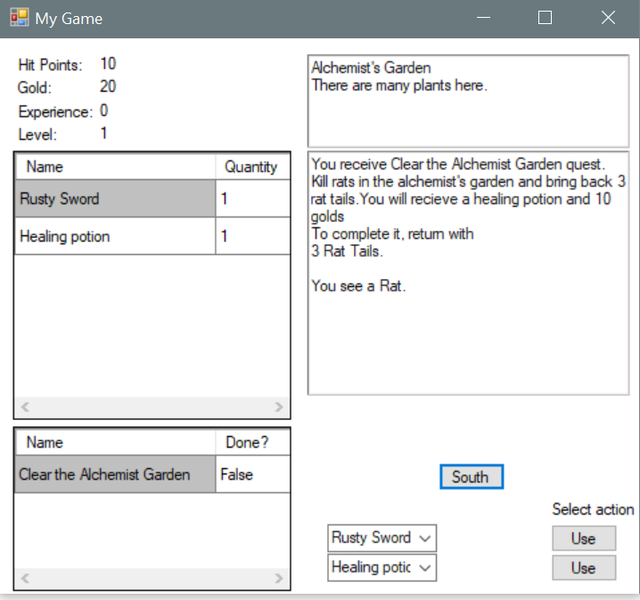

# C-RPG

This is the C# tutorial RPG game by Scott Lilly I decided to follow when I tried out C#.
There are two versions of the same game. SuperAdventure_V1 is an introductory tutorial
where Scott used to explain basic programming(classes, variable etc), 
and SuperAdventure_V2 is for more advanced programmer coming from anther language. 

To experience this game, you can go to the SuperAdventure_V1 folder and 
run

SuperAdventure.exe

Version 6/25/2018
